# Wombat Core 

[](https://github.com/illuin-tech/wombat-core/actions/workflows/maven-build.yml)
[](https://central.sonatype.com/artifact/tech.illuin/wombat-core)
[](https://javadoc.io/doc/tech.illuin/wombat-core)
[](https://codecov.io/gh/illuin-tech/wombat-core)


Wombat Core is the Java library powering [Wombat Carbon Tracker](https://github.com/illuin-tech/wombat).

It is distributed separately in order to:
* make it possible to build [custom extensions](https://github.com/illuin-tech/wombat#custom-extensions)
* make it possible to run the core engine [outside of the quarkus app](#custom-core)

## Installation

The library requires Java 21+ and adding the following in your `pom.xml`:

```xml
<dependency>
    <groupId>tech.illuin</groupId>
    <artifactId>wombat-core</artifactId>
    <version>0.11.0</version>
</dependency>
```

Additionally, some optional (but highly recommended) extension libraries can be added, at the time of this writing this includes `wombat-core-modules` which, as the name suggests, contains a few implementations enabled by default in the [Wombat application](https://github.com/illuin-tech/wombat).  

## Core Principles

### The Core: `WombatCore`

`WombatCore` is the central orchestration engine. It aggregates registered `WombatModule`s, tracks available asset types, and provisions two core operational services:
* `AssetMonitor` manages the data collection phase. It is designed to be triggered periodically in an asynchronous fashion and will coordinate metric polling via registered `WombatSource` and persist resulting activity metrics using a `WombatMetricPersister`
* `AssetEvaluator` coordinates asset activity resolution and impact estimation. It resolves service activity workload for a given `TimeRange` via `WombatActivityResolver`s and can output environmental impacts as well as financial costs using registered `WombatEvaluationResolver` implementations

### Core Components

Wombat relies on three fundamental component interfaces representing distinct stages of the collection and evaluation pipeline:
* `WombatSource` are triggered periodically by the `AssetMonitor`, they are expected to poll telemetry endpoints (e.g. Kubernetes API, Prometheus metrics, etc.) and returns `MetricData` to be persisted
* `WombatActivityResolver` are activity data aggregators. Given an `Asset`, a `TimeRange` and an optional `AssetFilter`, it computes a standardized representation of `ActivityData` (e.g. CPU nanocores, LLM token counts) from historical metrics or modeled profiles
* `WombatEvaluationResolver` are evaluation engines. Given an `Asset` and its resolved `ActivityData`, it computes either multi-criteria environmental footprints (`AssetImpact`) or financial costs (`AssetCost`).

_An overview:_

```mermaid
flowchart LR
    CORE_SETUP[WombatCore\nSetup]
    ASSET_DECLARATION[Asset\nConfiguration]

    subgraph SAMPLING[Async Activity Data Sampling]
        direction LR
        subgraph SOURCE[Wombat Sources]
            direction LR
            SOURCE_ORCHESTRATOR[Source\nOrchestration]
            
            SOURCE_A[WombatSource A]
            SOURCE_B[WombatSource B]
            SOURCE_C[WombatSource C]

            SOURCE_ORCHESTRATOR-->SOURCE_A
            SOURCE_ORCHESTRATOR-->SOURCE_B
            SOURCE_ORCHESTRATOR-->SOURCE_C
        end
        STORAGE_ACTIVITY[(Metrics Store)]

        SOURCE==>STORAGE_ACTIVITY
    end

    CALL{{Evaluation call}}

    subgraph ESTIMATION[Activity Evaluation]
        direction LR

        subgraph ACTIVITY[Wombat Activity Resolvers]
            direction LR
            ACTIVITY_RESOLVER_A[WombatActivity\nResolver A]
            ACTIVITY_RESOLVER_B[WombatActivity\nResolver B]
        end

        subgraph IMPACT_FINOPS[Wombat Cost Resolvers]
            direction LR
            FINOPS[Cost Resolving]
            FINOPS --> COST_EVAL_RESOLVER_A[WombatEvaluation\nResolver C]
            FINOPS --> COST_EVAL_RESOLVER_B[WombatEvaluation\nResolver D]
        end

        subgraph IMPACT_GREENOPS[Wombat Impact Resolvers]
            direction LR
            GREENOPS[Impact Resolving]
            GREENOPS --> IMPACT_EVAL_RESOLVER_A[WombatEvaluation\nResolver A]
            GREENOPS --> IMPACT_EVAL_RESOLVER_B[WombatEvaluation\nResolver B]
        end

        ACTIVITY ==>|GreenOps| IMPACT_GREENOPS
        ACTIVITY ==>|FinOps| IMPACT_FINOPS
    end

    GREENOPS_RESULT{{Multi-criteria Estimate\nkgCO2eq / MJ / kgSbeq}}
    FINOPS_RESULT{{Cost Estimate\n€ / $ / ¥}}

    %% Cross-Process Data Flows
    CORE_SETUP ==> ASSET_DECLARATION
    ASSET_DECLARATION ==> SAMPLING
    SAMPLING -.-> CALL
    CALL ==> ACTIVITY
    IMPACT_GREENOPS ==> GREENOPS_RESULT
    IMPACT_FINOPS ==> FINOPS_RESULT

    classDef configStyle fill:#cfd8dc88,stroke:#78909c,stroke-width:2px,color:#000
    classDef samplingStyle fill:#e3f2fd88,stroke:#64b5f6,stroke-width:2px,color:#000
    classDef triggerStyle fill:#ef5350ee,stroke:#c62828,stroke-width:2px,color:#fff
    classDef activityStyle fill:#ffe0b288,stroke:#ff9800,stroke-width:2px,color:#000
    classDef greenopsStyle fill:#e8f5e988,stroke:#81c784,stroke-width:2px,color:#000
    classDef finopsStyle fill:#fff9c488,stroke:#fdd835,stroke-width:2px,color:#000

    class CONFIG configStyle
    class SOURCE samplingStyle
    class CALL triggerStyle
    class ACTIVITY activityStyle
    class IMPACT_GREENOPS greenopsStyle
    class IMPACT_FINOPS finopsStyle
    class GREENOPS_RESULT greenopsStyle
    class FINOPS_RESULT finopsStyle
```



### Core Modules

Core modules provide ready-to-use implementations of asset types and their associated components:

| Module                                           | Family                 | Class                       | Components          | Description                                                                                                          |
|--------------------------------------------------|------------------------|-----------------------------|---------------------|----------------------------------------------------------------------------------------------------------------------|
| `tech.illuin.wombat-module.kubernetes-api`       | `KUBERNETES_CONTAINER` | `KubernetesAPIModule`       | `source`            | Connects to Kubernetes cluster APIs to poll CPU and memory resource metrics.                                         |
| `tech.illuin.wombat-module.llm-static`           | `LLM`                  | `LLMStaticModule`           | `activity-resolver` | Models static LLM workloads based on annual request profiles.                                                        |
| `tech.illuin.wombat-module.llm-prometheus`       | `LLM`                  | `LLMPrometheusModule`       | `source`            | Queries Prometheus via PromQL for LLM inference telemetry.                                                           |
| `tech.illuin.wombat-module.kubernetes-simulated` | `KUBERNETES_CONTAINER` | `KubernetesSimulatedModule` |                     | Special asset type used by the [Wombat app](https://github.com/illuin-tech/wombat#http-api) for simulation requests. |
| `tech.illuin.wombat-module.lmm-simulated`        | `LLM`                  | `KubernetesSimulatedModule` |                     | Special asset type used by the [Wombat app](https://github.com/illuin-tech/wombat#http-api) for simulation requests. |

#### Standalone & Default Components

The following components from `wombat-core` operate outside of specific modules and serve as default or standalone resolvers:

Activity Resolvers (`WombatActivityResolver`):
* `KubernetesActivityResolver` aggregates historical container and node metrics from persisted metric stores
* `LLMActivityResolver` aggregates historical LLM request activity and token consumption from persisted telemetry

Evaluation Resolvers (`WombatEvaluationResolver`):
* `BoaviztaEvaluationResolver` estimates multi-criteria environmental impacts (GHG emissions, primary energy, abiotic depletion) for server and container workloads using the Boavizta API
* `EcologitsEvaluationResolver` estimates multi-criteria environmental footprints for AI/LLM inferences using EcoLogits

## How to Use

*Documentation is coming soon™*

Following are a few code samples demonstrating basic usage of the `wombat-core` library.

### Custom Module

Custom modules enable tracking domain-specific assets or integrating custom activity modeling. To create a custom module, define an `Asset` with its profile, implement `WombatModule`, and provide the relevant resolvers (such as a `WombatActivityResolver`).

Here is an example of a custom module providing modeled activity data for LLM traffic:

```java
public class MySimulationModule implements WombatModule
{
    public static final AssetType TYPE = AssetType.of(
        "com.example", "wombat-module", "my-simulated-llm", ActivityRegime.MODELED, ServiceFamily.LLM
    );

    @Override
    public AssetType type() { return TYPE; }

    @Override
    public Class<? extends Asset> assetClass() { return MySimulationAsset.class; }

    @Override
    public Optional<WombatActivityResolver> createActivityResolver()
    {
        return Optional.of(new MySimulationActivityResolver());
    }
}

public record MySimulationAsset(
    AssetIdentity identity,
    MySimulationProfile profile
) implements Asset {
    @Override
    public AssetType type() { return MySimulationModule.TYPE; }

    public record MySimulationProfile(
        LLMProvider provider,
        String model,
        String location,
        long baseTokens
    ) implements LLMProfile {}
}

public class MySimulationActivityResolver implements WombatActivityResolver
{
    @Override
    public boolean accept(Asset asset)
    {
        return asset instanceof MySimulationAsset;
    }

    @Override
    public Optional<ActivityData> resolve(Asset asset, TimeRange range, AssetFilter filter)
    {
        MySimulationProfile profile = ((MySimulationAsset) asset).profile();

        // Diurnal traffic variation (sinusoidal peak during daytime hours)
        int hour = range.start().atZone(ZoneOffset.UTC).getHour();
        double diurnalFactor = 0.5 + 0.5 * Math.sin(Math.PI * (hour - 8) / 12.0);

        // Random jitter (±10%)
        double jitter = 1.0 + (ThreadLocalRandom.current().nextGaussian() * 0.1);
        long simulatedTokens = (long) (profile.baseTokens() * Math.max(0.1, diurnalFactor * jitter));
        double simulatedRequests = simulatedTokens / 200.0;

        String serviceId = asset.identity().id();
        LLMServiceActivity service = new LLMServiceActivity(
            profile.provider(),
            profile.model(),
            profile.location(),
            simulatedTokens,
            simulatedRequests
        );

        return Optional.of(new LLMActivityData(
            ActivityRegime.MODELED,
            Set.of(serviceId),
            range,
            Map.of(serviceId, service)
        ));
    }
}
```

Once defined, register the custom module with `WombatCore` and perform evaluations:

```java
try (WombatCore core = new WombatCore(
    contextProvider,
    metricsPersister,
    List.of(new MySimulationModule()),
    defaults -> { /** default handlers registration **/ }
); AssetEvaluator evaluator = core.createEvaluator()) {
    TimeRange range = new TimeRange(Instant.now().minus(Duration.ofHours(24)), Instant.now());
    List<AssetEvaluation> results = evaluator.evaluate(range, AssetFilter.none());
}
```

### Custom Core

[Wombat, the application](https://github.com/illuin-tech/wombat), obviously ships with its own `WombatCore` configured from [core-modules](#core-modules) and eventually user-provided [extensions](https://github.com/illuin-tech/wombat#custom-extensions).

But it is also possible to create your own `WombatCore` for use outside the application:

*Documentation is coming soon™*


## How to build

Building the project requires a Java 21+ JDK, in order to compile it:

```bash
mvn clean compile
```

Run all tests:

```bash
mvn clean test
```

Package it (as a .jar in `target/`):

```bash
mvn clean package
```

To package it without running tests, append `-DskipTests`:

```bash
mvn clean package -DskipTests
```
